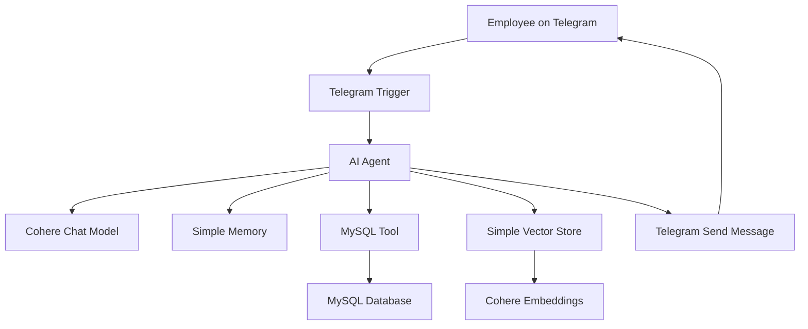
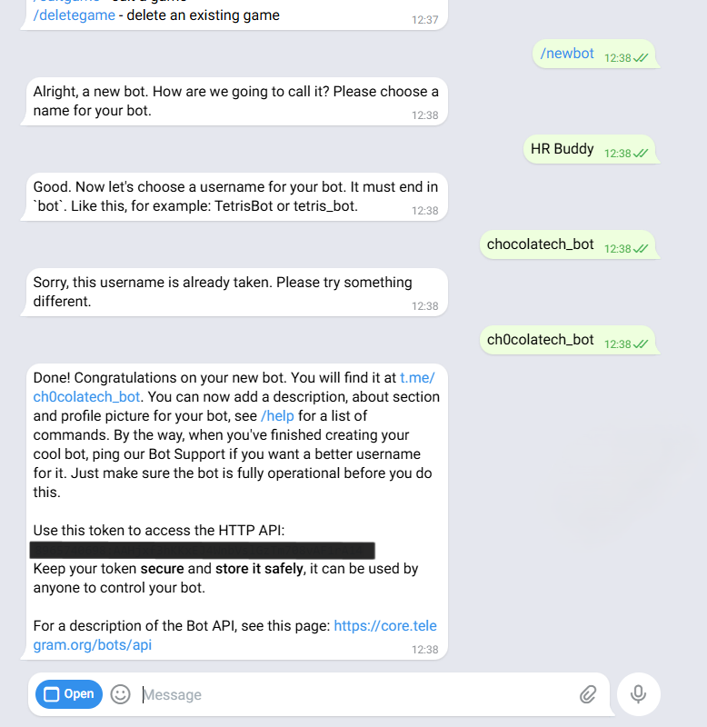
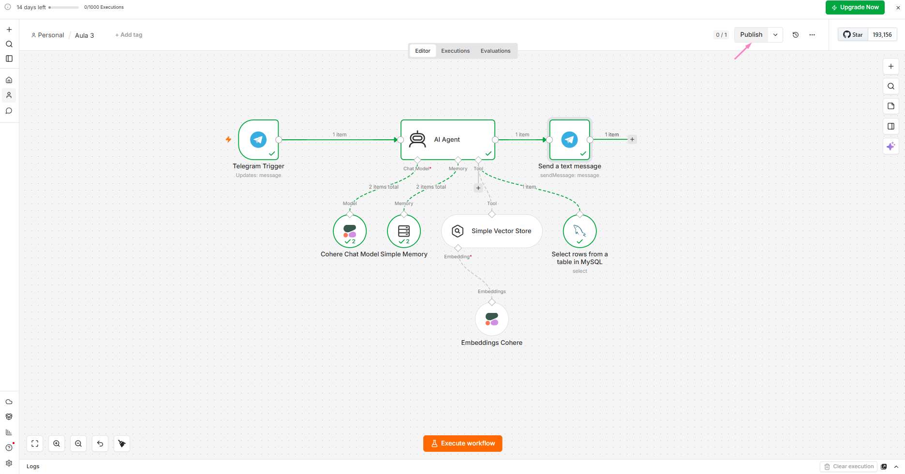
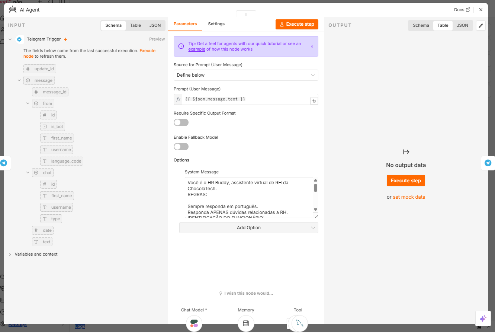
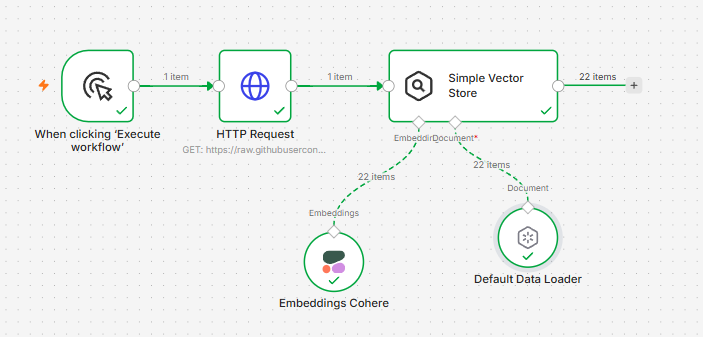
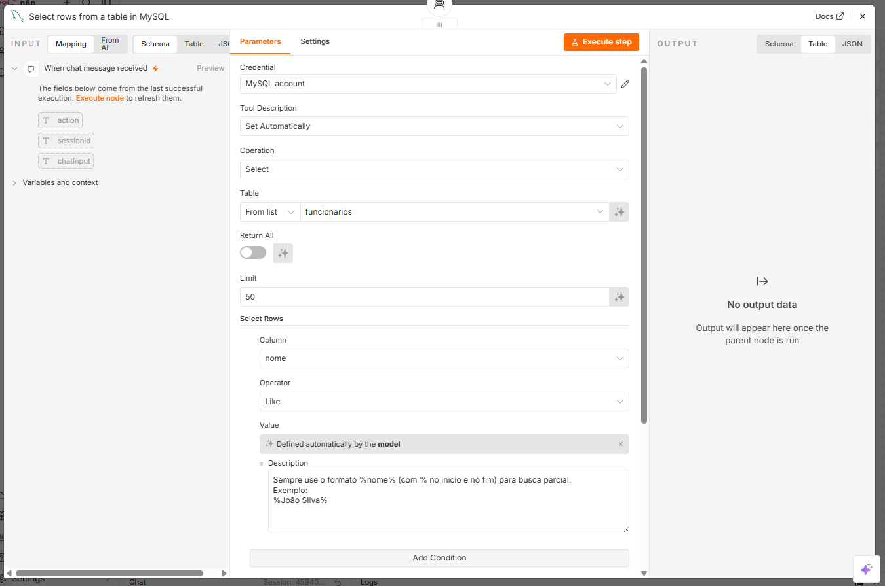
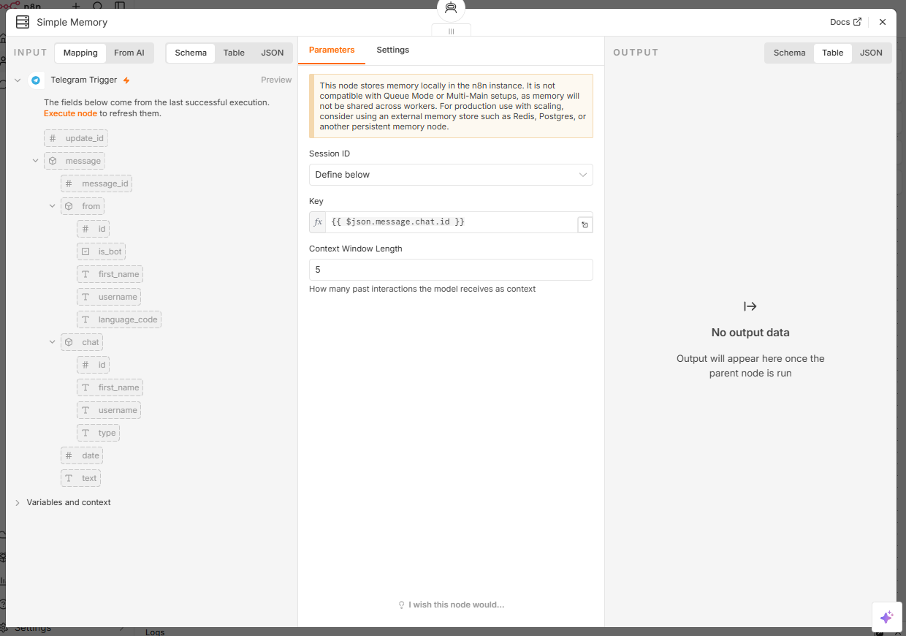
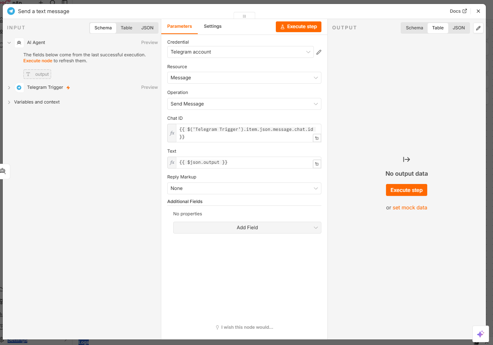
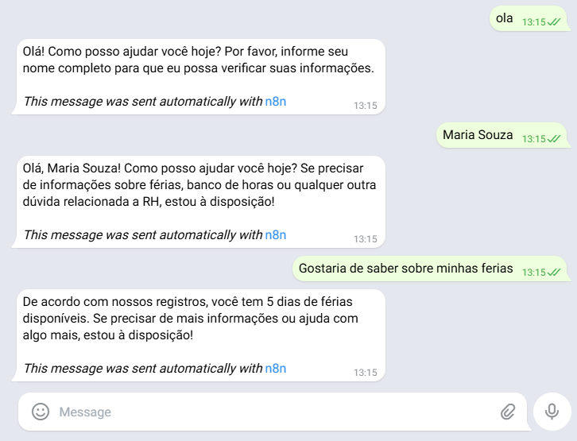

<div align="center">

# HR Buddy

**AI Agent for Human Resources Support on Telegram**

Telegram chatbot built with **n8n**, **Cohere**, **MySQL**, and **Retrieval-Augmented Generation (RAG)** during the Oracle + Alura AI Agents immersion.

[n8n](https://n8n.io/) | [Cohere](https://cohere.com/) | [MySQL](https://www.mysql.com/) | [Telegram Bot API](https://core.telegram.org/bots/api) | RAG | [Railway](https://railway.com/)

</div>

---

## Overview

HR Buddy is a proof-of-concept AI assistant designed to answer Human Resources questions through Telegram.

The project simulates an internal HR support workflow in which an employee sends a message to a Telegram bot and receives a response based on:

- general HR policy information retrieved through a Vector Store;
- employee-specific records stored in a MySQL database;
- short-term conversation memory managed by the user's Telegram chat session.

The goal of this project is to demonstrate how an AI agent can combine natural language understanding, tool usage, structured data, semantic search, and workflow automation in a practical business scenario.

---

## Project Highlights

- End-to-end chatbot workflow connected to Telegram.
- AI Agent built in n8n with external tools.
- RAG-based retrieval for HR policy questions.
- MySQL integration for structured employee information.
- Conversation memory using Telegram `chat.id` as the session key.
- Cohere used for both chat generation and embeddings.
- Workflow exported as JSON and documented for reproducibility.
- Security notes included for credentials, personal data, and production limitations.

---

## Architecture



The workflow has two main responsibilities:

- **Knowledge retrieval:** HR policy content is embedded and stored in a Vector Store, allowing the agent to retrieve relevant information by meaning.
- **Structured data access:** employee records are stored in MySQL and queried when the user asks for personal HR information such as vacation balance or time bank.

---

## Technology Stack

| Technology | Purpose |
|---|---|
| n8n | Workflow orchestration and AI agent automation |
| Cohere Chat Model | Natural language understanding and response generation |
| Cohere Embeddings | Text embeddings for semantic search |
| Simple Vector Store | Retrieval layer for HR policy content |
| MySQL | Structured employee data |
| Railway | Cloud-hosted database environment |
| Telegram Bot API | Chat interface for the end user |

---

## Workflow

```text
Telegram message
    -> Telegram Trigger
    -> AI Agent
    -> Tool selection
        -> Vector Store for policy questions
        -> MySQL for employee records
        -> Simple Memory for conversation context
    -> Telegram Send Message
    -> User receives the response
```

The AI Agent follows a system prompt that restricts the assistant to HR-related questions. When the user asks for personal information, the agent checks the employee name in MySQL. When the question is general, the agent retrieves context from the HR knowledge base.

---

## Repository Structure

```text
hr-buddy-ai-agent/
|-- README.md
|-- LICENSE
|-- assets/
|   |-- 01-botfather-telegram-bot.png
|   |-- 02-n8n-workflow-overview.png
|   |-- 03-ai-agent-configuration.png
|   |-- 04-vector-store-configuration.png
|   |-- 05-mysql-tool-configuration.png
|   |-- 06-simple-memory-session-id.png
|   |-- 07-telegram-send-message.png
|   |-- 08-telegram-final-test.png
|-- database/
|   |-- schema.sql
|-- docs/
|   |-- introductory-class.md
|   |-- class-1-rag-embeddings-n8n.md
|   |-- class-2-mysql-and-memory.md
|   |-- class-3-telegram-automation.md
|-- workflows/
|   |-- aula-3-hr-buddy.json
```

---

## Database

The project uses a MySQL table named `funcionarios` with fictitious employee data.

```sql
CREATE TABLE funcionarios (
    id INT AUTO_INCREMENT PRIMARY KEY,
    nome VARCHAR(100) NOT NULL,
    email VARCHAR(150) NOT NULL UNIQUE,
    departamento VARCHAR(100) NOT NULL,
    cargo VARCHAR(100) NOT NULL,
    data_admissao DATE NOT NULL,
    saldo_ferias INT NOT NULL DEFAULT 0,
    banco_horas DECIMAL(5,1) NOT NULL DEFAULT 0,
    regime VARCHAR(20) NOT NULL DEFAULT 'hibrido'
);
```

The complete database script is available in:

```text
database/schema.sql
```

---

## How to Reproduce

1. Clone this repository.
2. Create a Telegram bot using BotFather.
3. Create a MySQL database and run `database/schema.sql`.
4. Import `workflows/aula-3-hr-buddy.json` into n8n.
5. Configure the required credentials in n8n:
   - Telegram account;
   - Cohere API key;
   - MySQL connection.
6. Load the HR policy content into the Vector Store.
7. Test the workflow using a Telegram conversation.
8. Activate or publish the workflow when the test is successful.

> This project does not include real API keys, Telegram tokens, or database credentials.

---

## Implementation Evidence

### Telegram Bot Creation

The bot was created through BotFather, which generated the Telegram Bot API token used later as an n8n credential.



### n8n Workflow Overview

The main workflow connects the Telegram trigger, AI Agent, Cohere model, memory, Vector Store, MySQL tool, and Telegram response node.



### AI Agent Configuration

The AI Agent receives the Telegram message text and follows a system prompt that defines its role, scope, and tool usage rules.



### Vector Store Configuration

The Vector Store is populated with HR policy content and uses Cohere embeddings to support semantic retrieval.



### MySQL Tool Configuration

The MySQL tool performs read-only searches in the `funcionarios` table, using the employee name as the lookup field.



### Memory Configuration

The Simple Memory node uses the Telegram `chat.id` as the session identifier, allowing separate conversations to keep separate context.



### Telegram Response Configuration

The response node sends the AI Agent output back to the same Telegram chat that triggered the workflow.



### Final Test

The assistant identifies the employee, keeps the conversation context, queries the database, and returns the available vacation balance.



---

## Example Conversation

The current workflow is configured to answer users in Portuguese. The conversation below is translated into English for documentation purposes.

```text
User: Hello

HR Buddy: Hello. How can I help you today? Please provide your full name so I can check your information.

User: Maria Souza

HR Buddy: Hello, Maria Souza. How can I help you today?

User: I would like to know about my vacation balance.

HR Buddy: According to our records, you have 5 vacation days available.
```

---

## Security and Privacy

This repository is intended for learning and portfolio purposes. It is not a production-ready HR system.

Important considerations for a real implementation:

- authenticate the employee before returning personal data;
- avoid relying only on a typed name as identity validation;
- store secrets only in secure credential managers;
- review exported n8n workflows before publishing them;
- avoid committing API keys, Telegram tokens, connection strings, or real employee data;
- add audit logs for sensitive HR requests;
- define access control rules for employee-specific information.

---

## What This Project Demonstrates

This project demonstrates the ability to:

- design a practical AI automation workflow;
- connect an AI agent to external tools;
- combine RAG and relational data in the same assistant;
- use embeddings for semantic search;
- model a simple database for employee records;
- integrate a chatbot with Telegram;
- manage session-based memory;
- document implementation decisions clearly;
- identify security limitations in AI systems that handle personal data.

---

## Future Improvements

- Add authentication before returning employee-specific information.
- Replace local memory with persistent memory such as Redis or Postgres.
- Add fallback handling for unavailable APIs or database failures.
- Add logging and monitoring for workflow executions.
- Create a Docker-based local setup.
- Add automated tests for expected conversation flows.
- Add human handoff for sensitive HR topics.

---

## Acknowledgements

This project was developed during the Oracle + Alura AI Agents immersion as a hands-on exercise in automation, RAG, databases, and conversational AI.

---

## License

This project is licensed under the MIT License.
